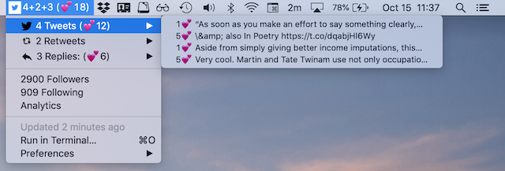

# bitbar_todays_tweets
[BitBar](https://getbitbar.com/) plugin to show today's tweets in Mac menubar.

Requires python3, [tweepy](https://www.tweepy.org/), and [Twitter developer API](https://developer.twitter.com/) access (which is easy to request).

## Installation instructions

1. Set up [BitBar](https://getbitbar.com/)
2. Ensure [tweepy](https://www.tweepy.org/) is installed
3. Set up bitbar_todays_tweets by editing `todays_tweets.30m.py`
   1. Replace `/usr/local/bin/python3` in the first line with the path to your python3 installation
   2. Replace `KEY`, `SECRET`, `TOKEN`, and `TOKENSECRET` with your [Twitter developer API](https://developer.twitter.com/) API keys
4. Rename `todays_tweets.30m.py` if you want it to run at a frequency other than every 30 minutes
5. Move `todays_tweets.30m.py` into your [BitBar](https://getbitbar.com/) plugin folder, and ensure it can be executed using `chmod +x plugin.sh'

## Caveats

This is very much a work-in-progress toy project by a highly amateur Python programmer. Also, there is currently no error handling.
